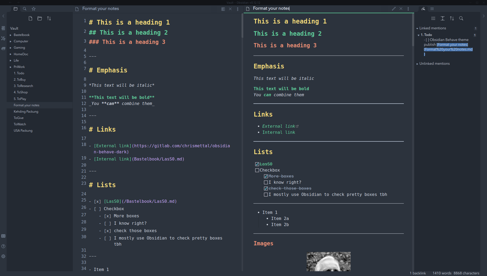
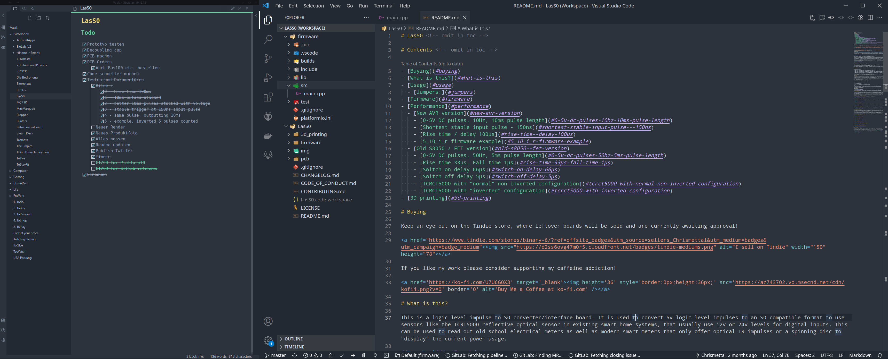

# Behave-dark theme for Obsidian <!-- omit in toc -->

Port of the awesome, eye friendly [Behave theme](https://github.com/fnky/behave-theme) by Christian Petersen. Only dark mode is supported as the name suggests. To be used with [Obsidian.md](https://Obsidian.md).

Customized from the dracula theme found [here](hthttps://github.com/dracula/obsidian).

Here is a side by side between Obsidian.md and VSCode using the [Behave full theme](https://github.com/Chrismettal/Behave-full-Theme), making working with the two absolutely seamless:

The Behave theme is also available for [FreeCAD](https://github.com/Chrismettal/FreeCAD-Behave-dark) as well as [KiCAD](https://github.com/pointhi/kicad-color-schemes), giving you a full stack suite all in the same theme!

If you like my work please consider supporting my caffeine addiction!

## Installation

~~Rename `obsidian.css` to `Behave-dark.css` and move it into your `.obsidian/themes` folder, restart Obsidian and choose the `Behave-dark` option under `Appearence/themes`~~

This theme is now available from within Obsidian, by opening op your settings, navigating to `Appearance`, hitting `Browse` on the `Community themes` section, and looking for `Behave dark`!
