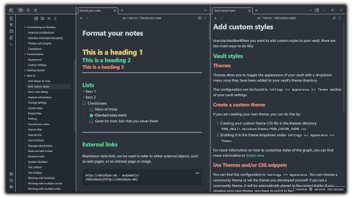

# Behave-dark theme for Obsidian <!-- omit in toc -->

Customized from the dracula theme found [here](hthttps://github.com/dracula/obsidian).

Port of the awesome [Behave theme](https://github.com/fnky/behave-theme) by Christian Petersen. Only dark mode is supported as the name suggests. To be used with [Obsidian.md](https://Obsidian.md).

Here is a comparison between Obsidian.md and VSCode using the [Behave full theme](https://github.com/Chrismettal/Behave-full-Theme):

If you like my work please consider supporting my caffeine addiction!

## Installing

Move `Behave-dark.css` into your `.obsidian/themes` folder, restart Obsidian and choose the `Behave-dark` option under `Appearence/themes`